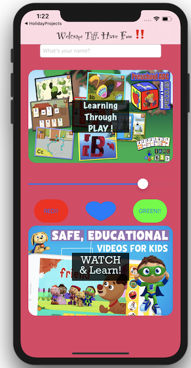

README

## My Project

This project is the humble start of my passion project which is to create a free game/learning app for children of all ages and capabilities. However, many features of this app are and will be directed towards children with developmental disabilities: specifically, for now, Austism. the idea is to not try to force these superstarts to conform to "nomality" persay, but instead to help strengthen their contorl "abnomalities". 

## Screenshot 

   

## Project.Gif

